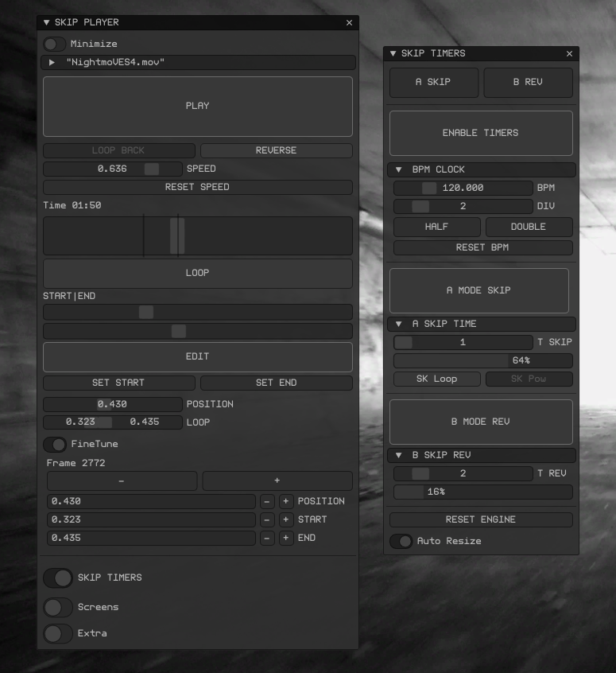

# ofxSurfingVideoSkip

<h4 align="center">A custom, experimental and personal **Video Loops Player Engine**.</h4>
<h5 align="center">A custom, experimental and personal **Video Loops Player Engine**.</h5>

  <a href="#Overview">Overview</a> •
  <a href="#Core-Features">Core Features</a> •
  <a href="#Optional-Modules">Optional Modules</a>

### **WIP**

## Overview
A custom, experimental and personal **Video Loops Player Engine**.  

## Core Features
- Hap codec player for fast scrub
- In / Out marks
- Speed
- Reverse
- Skip Timers  
  - Beat/BPM mode or absolute Duration mode
  - Skip Timer
  - Reverse Timer

## Screenshot

### Optional Modules
- Presets management using **ofxSurfingPresets**.
- Mood Machine / Randomizer using **ofxSurfingMoods**.
- OSC receiver to change presets using **ofxSurfingOsc**.
- NDI sender using **ofxNDI**.
- Post Fx shaders using **ofxSurfingFxPro**.
- External clock using **ofxBeatClock**.

## Dependencies
- [ofxHapPlayer](https://github.com/bangnoise/ofxHapPlayer)
- [ofxSurfingImGui](https://github.com/moebiussurfing/ofxSurfingImGui)
- [ofxImGui](https://github.com/Daandelange/ofxImGui/) / Fork
- [ofxSurfingBox](https://github.com/moebiussurfing/ofxSurfingBox)
- [ofxSurfingHelpers](https://github.com/moebiussurfing/ofxSurfingHelpers)
- ofxGui / oF core

#### Optional Add-ons / Compatible Modules:
Can be disabled / enabled using directives.  
- [ofxSurfingPresets](https://github.com/moebiussurfing/ofxSurfingPresets)
- [ofxSurfingMoods](https://github.com/moebiussurfing/ofxSurfingMoods)
- [ofxNDIHelper](https://github.com/moebiussurfing/ofxNDIHelper)
- [ofxSurfingOsc](https://github.com/moebiussurfing/ofxSurfingOsc)
- [ofxSurfingFxPro](https://github.com/moebiussurfing/ofxSurfingFxPro)
- [ofxBeatClock](https://github.com/moebiussurfing/ofxBeatClock)