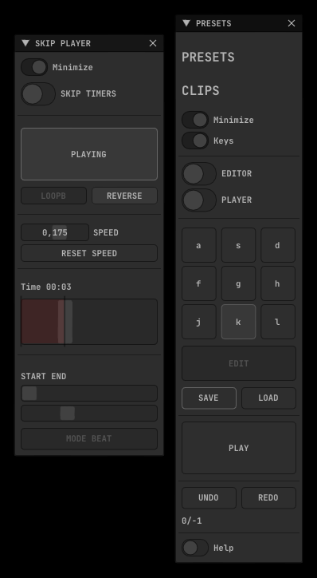

# ofxSurfingVideoSkip

### **WIP**

## Screenshot

## Overview
A custom, experimental and personal **Video Loops Player Engine**.  

- Hap codec player / fast scrub
- In / Out marks
- Speed
- Reverse
- Skip Timer
- Reverse Timer
- Beat / BPM mode and absolute Duration mode for the Timers  

### Optional Modules
- Presets management using **ofxSurfingPresets**.
- External clock using **ofxBeatClock**.
- Mood Machine / Randomizer using **ofxSurfingMoods**.
- OSC receiver to change presets using **ofxSurfingOsc**.
- Post Fx shaders using **ofxSurfingFxPro**.
- NDI sender using **ofxNDI**.

## Dependencies
- ofxGui / oF core
- [ofxHapPlayer](https://github.com/bangnoise/ofxHapPlayer)
- [ofxSurfingImGui](https://github.com/moebiussurfing/ofxSurfingImGui)
- [ofxImGui](https://github.com/Daandelange/ofxImGui/) / Fork
- [ofxSurfingBox](https://github.com/moebiussurfing/ofxSurfingBox)
- [ofxSurfingHelpers](https://github.com/moebiussurfing/ofxSurfingHelpers)

#### Optional Add-ons:
Can be disabled / enabled using directives.  
- [ofxSurfingPresets](https://github.com/moebiussurfing/ofxSurfingPresets)
- [ofxSurfingMoods](https://github.com/moebiussurfing/ofxSurfingMoods)
- [ofxNDIHelper](https://github.com/moebiussurfing/ofxNDIHelper)
- [ofxSurfingOsc](https://github.com/moebiussurfing/ofxSurfingOsc)
- [ofxSurfingFxPro](https://github.com/moebiussurfing/ofxSurfingFxPro)
- [ofxBeatClock](https://github.com/moebiussurfing/ofxBeatClock)